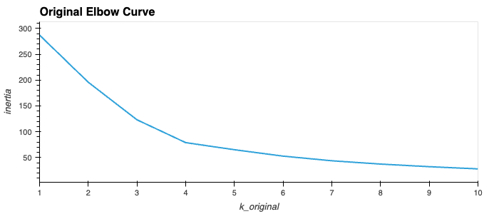
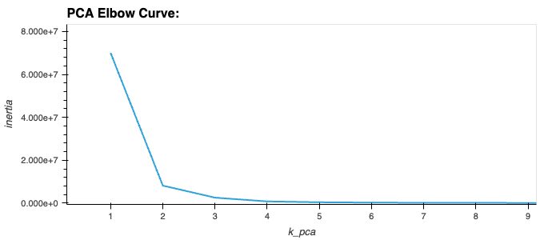
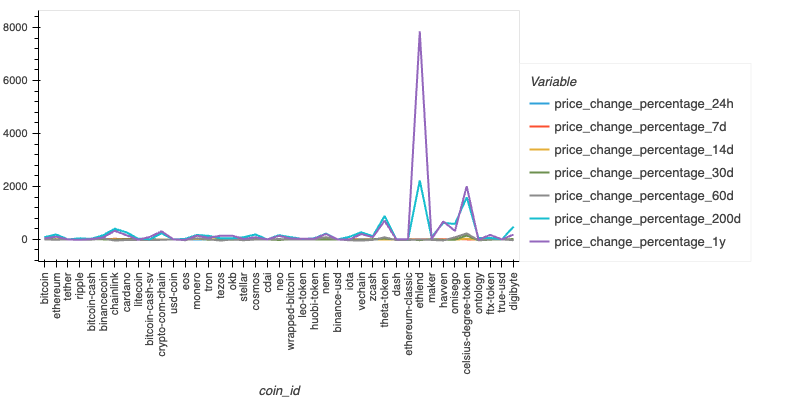
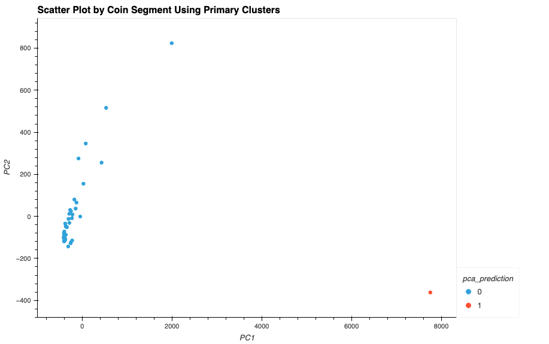

# Crypto Clustering Challenge

## Overview

This project uses the K-means clustering machine learning technique to predict if cryptocurrencies are affected by 24-hour or 7-day price changes. Additionally, the project explores the impact of dimensionality reduction using Principal Component Analysis (PCA).

## Dependencies

- Python
- Pandas
- NumPy
- Scikit-learn
- hvPlot

## Steps

1. Load and preprocess the data.
2. Scale the data using StandardScaler.
3. Identify the best value for k using the elbow method.
4. Cluster cryptocurrencies with K-means using the original scaled data.
5. Perform PCA to reduce number of features to three principal components.
6. Find the best value for k using the PCA data.
7. Cluster cryptocurrencies with K-means using the PCA data.
8. Visualize and compare the results using hvPlot.

## Conclusion

This project analyzed the impact of using fewer features on clustering crypto data using K-means. Comparing the clustering results of the original data and the PCA adusted data suggested fewer features were more accurate. In the original data clustering, the elbow curve indicated that the optimal value for K was 4, resulting in 4 clusters. However, there were two clusters that only contained one data point each, and the other two clusters were not clearly separated. By implementing PCA and using the optimal value for K of 2, the resulting plot was more accurate and precise in clustering the data.

